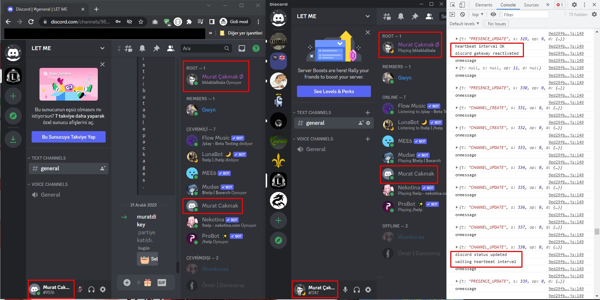

- [(EN) How to enable Ctrl+Shift+i on Discord](https://medium.com/@murat-cakmak/how-to-enable-ctrl-shift-i-on-discord-50e146fccca8)
- [(TR) Nasıl Discord’da Ctrl + Shift + i Aktif Edilir](https://medium.com/@murat-cakmak/nas%C4%B1l-discordda-ctrl-shift-i-aktif-edilir-cb84306faf96)

### How to use
1. get your token in request @me.
2. add to "token" variable in js file.
3. run your script on discord console.

